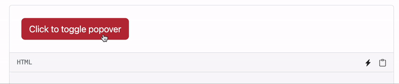
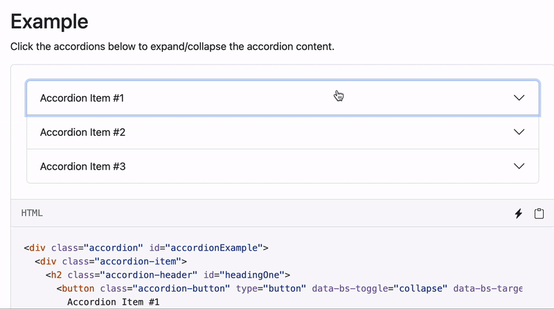
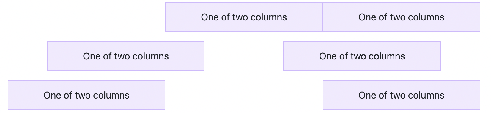
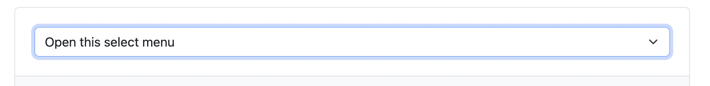
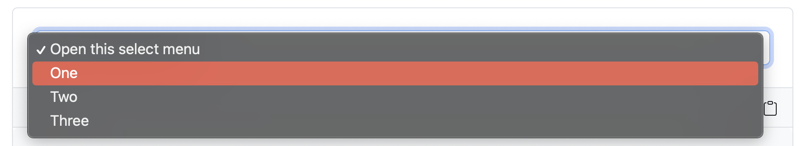

----

# Portfolio Site Day 2 - Part 2
###### Author: Ray Tang
Welcome back from Lunch Break!

### Objectives
- Learn Bootstrap
- Implement Bootstrap
- Do a few tests (play around with it)

### Preview


Cool right? (shh...you're gonna learn how to build these!)

### Lesson
____
- You guys played around with normal CSS before the lunch break
- Now, we're learning a CSS Framework called `Bootstrap` CSS.
> CSS Framework: Some code that other people wrote so that you can make CSS easier.
>
> Official definition:  "a combination of design best-practices and standardized class systems that provide a basic structure for styling a web page. Practically, they are usually an external stylesheet that you link to, giving you a grid system to layout content and a collection of CSS classes to style elements with.""
>
> 

Essentially, a CSS framework is a big CSS file that someone else wrote to help with CSS wroting and styling. 

>"Why does this matter??? I can just write it myself! It's so stupid and useless and its a waste of time."

Dont worry, I thought this too when I was learning Bootstrap. Turns out, its very convenient and provides lots of styling that you would need to write a lot of code for otherwise. 

_____

To give you a small appetizer, this is some of the stuff you can do with Bootstrap:   


..............

Accordion Collapsing Text

Dynamic NavBar

Info Popup


_____
Alright.

Consider this: You're making a product presentation website and you want 3 vertical calumns to put text in describing your product specs. You're going for something that looks like this:


_____
* To do this in HTML and CSS, you would need the following:


HTML File:
```html
<div class="row">
  <div class="column"></div>
  <div class="column"></div>
  <div class="column"></div>
</div>
```
CSS File:
```css
.column {
  float: left;
  width: 33.33%;
}

/* Clear floats after the columns */
.row:after {
  content: "";
  display: table;
  clear: both;
}

```

____ 
Although this gives us the desired result, it's inneficient and takes a lot of effort to change the horizontal alignment. 
* However, with Bootstrap , your files would look like this:

```html
<div class="container text-center">
  <div class="row align-items-start">
    <div class="col">
      One of three columns
    </div>
    <div class="col">
      One of three columns
    </div>
    <div class="col">
      One of three columns
    </div>
  </div>
```
_____

* All of the CSS is already written for you which saves a lot of time.
* Manually changing the number of colums or the horizontal alignment is very easy as well:


```html
  <!-- moving all coloums to the right -->
  <div class="row justify-content-end">
    <div class="col-4">
      One of two columns
    </div>
    <div class="col-4">
      One of two columns
    </div>
  </div>


  <!-- leaves a space in the center of the coloums -->
  <div class="row justify-content-around">
    <div class="col-4">
      One of two columns
    </div>
    <div class="col-4">
      One of two columns
    </div>
  </div>


  <!-- adds a bigger space where you can put stuff between -->
  <div class="row justify-content-between">
    <div class="col-4">
      One of two columns
    </div>
    <div class="col-4">
      One of two columns
    </div>
  </div>

  ```
_____
  This is what the result from the above code would somewhat look like:


_____

This website has a lot of bootstrap features (kinda like a dictionary for bootstrap). Use it for research and reference!

https://getbootstrap.com/docs/5.2/getting-started/introduction/

(use the left navbar)

1. Research some Bootstrap and use it in your website! There's a lot more to bootstrap than just making it easier to make coloums.
>You don't HAVE to include the example coloums in your website, but you are totally ALLOWED to copy/paste it!
2. Come back in 10 minutes to showcase what you researched and how you added that into your website.

_____
Here's some ideas to get you started:


### Select Menu

```html
<select class="form-select" aria-label="Default select example">
  <option selected>Open this select menu</option>
  <option value="1">One</option>
  <option value="2">Two</option>
  <option value="3">Three</option>
</select>


```
Result:




### Accordion Text

```html

<div class="accordion" id="accordionExample">
  <div class="accordion-item">
    <h2 class="accordion-header" id="headingOne">
      <button class="accordion-button" type="button" data-bs-toggle="collapse" data-bs-target="#collapseOne" aria-expanded="true" aria-controls="collapseOne">
        Accordion Item #1
      </button>
    </h2>
    <div id="collapseOne" class="accordion-collapse collapse show" aria-labelledby="headingOne" data-bs-parent="#accordionExample">
      <div class="accordion-body">
        <strong>This is the first item's accordion body.</strong>
      </div>
    </div>
  </div>
  <div class="accordion-item">
    <h2 class="accordion-header" id="headingTwo">
      <button class="accordion-button collapsed" type="button" data-bs-toggle="collapse" data-bs-target="#collapseTwo" aria-expanded="false" aria-controls="collapseTwo">
        Accordion Item #2
      </button>
    </h2>
    <div id="collapseTwo" class="accordion-collapse collapse" aria-labelledby="headingTwo" data-bs-parent="#accordionExample">
      <div class="accordion-body">
        <strong>This is the second item's accordion body.</strong> 
      </div>
    </div>
  </div>
  <div class="accordion-item">
    <h2 class="accordion-header" id="headingThree">
      <button class="accordion-button collapsed" type="button" data-bs-toggle="collapse" data-bs-target="#collapseThree" aria-expanded="false" aria-controls="collapseThree">
        Accordion Item #3
      </button>
    </h2>
    <div id="collapseThree" class="accordion-collapse collapse" aria-labelledby="headingThree" data-bs-parent="#accordionExample">
      <div class="accordion-body">
        <strong>This is the third item's accordion body.</strong> 
      </div>
    </div>
  </div>
</div>
```

______
Result:


